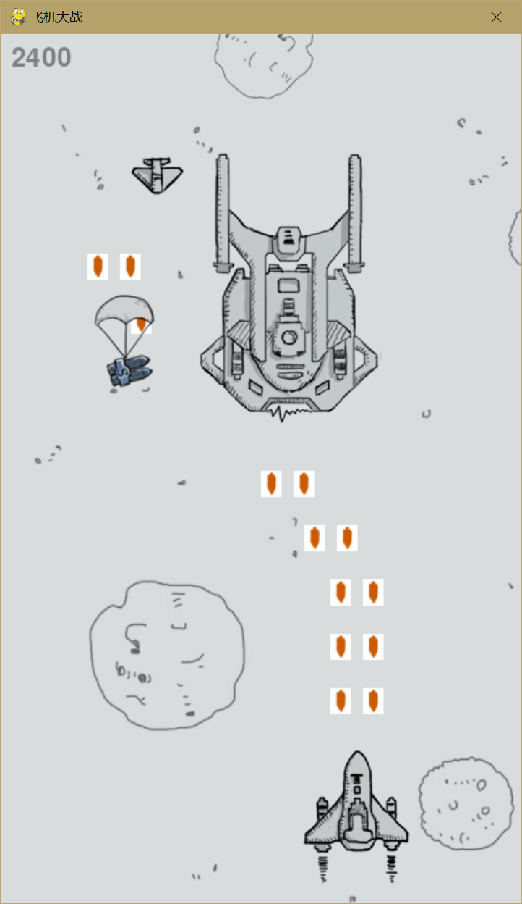

# 🚀 飞机大战游戏

一个基于 Python 和 Pygame 开发的经典射击游戏。在游戏中，玩家控制飞机躲避敌人的攻击，收集道具提升火力，获得高分。



## ✨ 特色功能

- 🎮 流畅的游戏控制
- 🎯 多种武器系统
- 👾 不同类型的敌人
- 🎵 动感音效和背景音乐
- 📊 实时分数显示
- 🎁 道具收集系统

## 🛠️ 技术栈

- Python 3.x
- Pygame
- Tkinter (用于开始界面)

## 📦 安装说明

1. 确保你的电脑已安装 Python 3.x
2. 克隆项目到本地：
```bash
git clone .....
```

3. 安装依赖：
```bash
pip install pygame
```

4. 运行游戏：
```bash
python main.py
```

## 🎮 游戏操作

- W/↑: 向上移动
- S/↓: 向下移动
- A/←: 向左移动
- D/→: 向右移动
- 自动射击：飞机会自动发射子弹

## 🌟 游戏特性

1. **升级系统**
   - 收集道具可以提升火力
   - 最高可达到三级火力

2. **敌人系统**
   - 普通敌机：生命值低，速度快
   - 精英敌机：生命值高，击落后高分

3. **计分系统**
   - 击落敌机获得分数
   - 实时显示当前得分

## 📁 项目结构

```
Aircraft-War/
│
├── main.py              # 主游戏文件
├── source/             # 资源文件夹
│   ├── background.jpg   # 背景图片
│   ├── player.png       # 玩家飞机图片
│   ├── enemy.png        # 敌机图片
│   ├── bullet2.jpg      # 子弹图片
│   └── ...             # 其他资源文件
│
└── README.md           # 项目说明文档
```

## 🤝 贡献指南

欢迎提交 Issue 和 Pull Request 来帮助改进游戏！

1. Fork 本仓库
2. 创建你的特性分支 (`git checkout -b feature/AmazingFeature`)
3. 提交你的改动 (`git commit -m 'Add some AmazingFeature'`)
4. 推送到分支 (`git push origin feature/AmazingFeature`)
5. 开启一个 Pull Request

## 📝 开源协议

本项目采用 MIT 协议开源，详情请参阅 [LICENSE](LICENSE) 文件。

## 👥 致谢

感谢所有为这个项目做出贡献的开发者！

---

⭐️ 如果你喜欢这个项目，欢迎点个 star！
